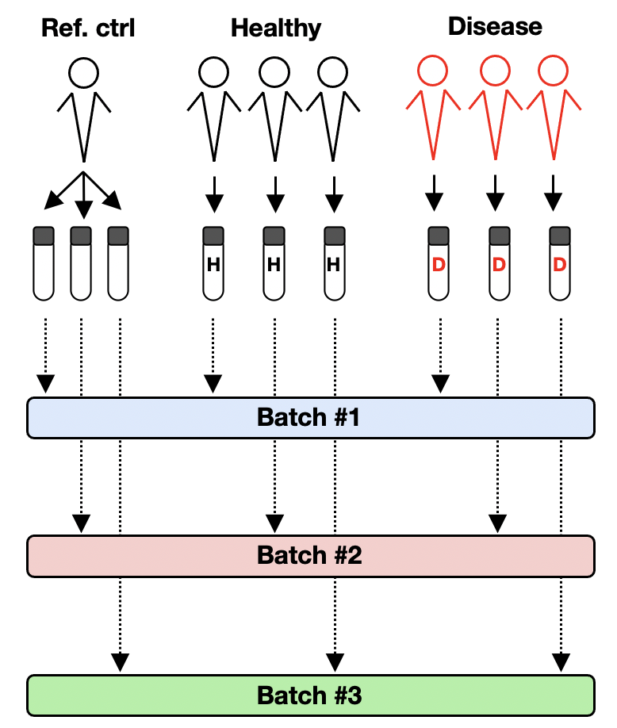
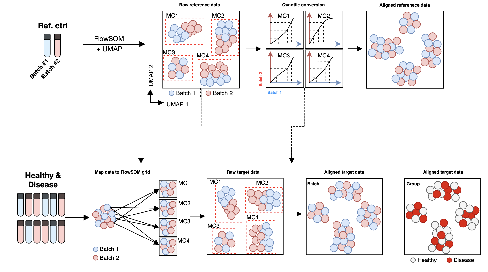

```{r setup, include=FALSE}
knitr::opts_chunk$set(echo = TRUE)
```

------------------------------------------------------------------------

[\<- Back to Spectre home page](https://immunedynamics.io/spectre)

<br /> <br />

## Introduction

------------------------------------------------------------------------

**Overview**

The batch alignment and analysis workflow builds on the 'simple discovery' workflow by adding a step to facilitate batch alignment. This workflow allows for the correction of technical variation or shifts in signal levels in samples stained and/or acquired across multiple batches. To do this, we have implemented the CytoNorm algorithm (Van Gassen 2020). CytoNorm uses reference control samples that are prepared and recorded along with each batch of samples to identify and correct technical variations between individual batches, while preserving biologically relevant differences. For more information on CytoNorm, see Van Gassen et al 2020, and for more information on our implementation in Spectre, see Ashhurst et al 2021.

The demo dataset used for this worked example are cells extracted from mock- or virally-infected mouse bone marrow, measured by flow cytometry. Expression level values in these datasets have been manipulated to simulate acquisition over two batches.

**Reference controls for CytoNorm**

An example of reference control samples are aliquots of peripheral blood mononuclear cells (PBMCs) that are derived from a single donor at one time point, and cryopreserved (i.e. multiple aliquots of a biologically identical sample). Each time a set of PBMC samples from the study cohort are thawed, stained, and recorded, a reference controls is also thawed, stained, and recorded. Differences in signal level between the reference controls allows CytoNorm to learn the differences in signal levels due to the batches, and correct them, while preserving biological differences between the individual samples. In our demo dataset, we are using bone marrow samples derived from separate mice. Though not derived from the same mouse, these are similar enough that they can be used successfully as reference controls.

{width="500"}

**Correction of batch effects with CytoNorm**

Reference samples are clustered together using FlowSOM, where we attempt to captures cells from matching populations in each batch in a single metacluster (e.g. neutrophils from batch 1 and 2 are captured in metacluster 1, etc). This assumes a reasonably low level of batch effect, consisting of small shifts in the expression levels for one or more markers. Because the proportion of cells in each population of the reference samples are identical, FlowSOM can use quantile distributions for each marker on each metacluser to create a model which will adjust the data values, removing technical variation between batches. This model is then applied to all samples in each batch.



**Requirements**

The reference controls can only correct batch effects for markers which are actually expressed on the reference controls. For example, some activation markers may be expressed on samples from the 'disease' group, but won't be present on reference controls derived from healthy donors. In this case, we would simply not attempt to perform alignment on that marker. Typically, stable phenotyping markers (e.g. CD4, CD8) would be expressed strongly enough in reference samples, and would be suitable for alignment.

**Other approaches**

If you have samples derived from multiple batches, but do not have reference controls processed with each batch, then other forms of batch alignment might be possible -- see our data integration options for more information.

<br />

## Citation and methods

------------------------------------------------------------------------

**Citation**

If you use Spectre in your work, please consider citing [Ashhurst TM, Marsh-Wakefield F, Putri GH et al. (2022). Cytometry Part A 101 (3), 237-253](https://onlinelibrary.wiley.com/doi/full/10.1002/cyto.a.24350). Please also consider citing the authors of the individual packages or tools (e.g. CytoNorm, FlowSOM, tSNE, UMAP, etc) that are critical elements of your analysis work.

**Sample methods blurb**

Here is a sample methods blurb for this workflow. You may need to adapt this text to reflect any changes made in your analysis.

*Computational analysis of data was performed using the Spectre R package (Ashhurst et al., 2022), with instructions and source code provided at <https://github.com/ImmuneDynamics/spectre>. Samples were initially prepared in FlowJo, and the population of interest was exported as raw value CSV files. Arcsinh transformation was performed on the data in R using a co-factor of 15 to redistribute the data on a linear scale and compress low end values near zero. The dataset was then merged into a single data.table, with keywords denoting the sample, group, and other factors added to each row (cell). The CytoNorm algorithm was used to correct for batch effects in the data using matched reference samples processed in each batch. The FlowSOM algorithm (Van Gassen et al., 2015) was then run on the merged dataset to cluster the data, where every cell is assigned to a specific cluster and metacluster. Subsequently, the data was downsampled and analysed by the dimensionality reduction algorithm Uniform Manifold Approximation and Projection (UMAP) (McInnes, Healy, Melville, 2018) for cellular visualisation.*

<br />

## Setup

------------------------------------------------------------------------

**Software:** For instructions downloading R, RStudio, and Spectre, please see this section on the home page.

**Analysis script:** Please visit <https://github.com/ImmuneDynamics/Spectre>, and download the repository:

\~

You can then find the 'batch alignment and analysis workflow' script under 'worked examples':

Create a folder for your experiment, and place the script in that folder.

**Export the population of interest (POI) from your files.**

Please see this page for detailed instructions on exporting data for Spectre. When using fluorescence data, please ensure you are exporting the data from compensated channels, indicated by 'Comp-Channel Name' (e.g. Comp-B515). Feel free to include any other relevant parameters as well (FSC, SSC, time etc). We recommend exporting CSV 'scale' value data, or alternatively exporting FCS files. These represent the untransformed data values. You are also welcome to use the CSV 'channel' value data, which uses a form of 'binning' to transform the data onto a linear distribution -- please read this page for a more detailed explanation on CSV channel values.

\~

<br />

## 1. Load packages and set directories

------------------------------------------------------------------------
