```{r setup, include=FALSE}
knitr::opts_chunk$set(echo = TRUE)
```

------------------------------------------------------------------------

[\<- Back to Spectre home page](https://immunedynamics.io/spectre)

<br />

## Overview

------------------------------------------------------------------------

Spectre is a software package in 'R'. There two options for using Spectre:

- Option 1: [Installing via RStudio]. Here you can download R and RStudio, and then install the Spectre package within this framework.
- Option 2: [Installing via Docker]. You can download a Docker image that contains a pre-compiled installation of R, RStudio, the Spectre package, and other associated packages. This is a useful option for reproducible analysis.

<br />

## Installing via RStudio

------------------------------------------------------------------------

Follow these instructions for installing Spectre in R via RStudio. 

<br />

#### Install R and RStudio

Download the latest version of R and R Studio by visiting the links below.

-   [Download R (CRAN)](https://cran.r-project.org/mirrors.html)
-   [Download RStudio](https://www.rstudio.com/products/rstudio/download/#download)

Once you have installed R and RStudio, you can check out our introductory tutorial on the [getting started](https://immunedynamics.io/spectre/getting-started/) page to get familiar with using it.

<br />

#### Install the Spectre package

Run the following code in R to install the Spectre package.

```{r, results = 'hide', message=FALSE, warning=FALSE, eval=FALSE, echo=TRUE}
# Install the package 'remotes' if not already installed
if(!require('remotes')) {install.packages('remotes')} 

# Install the Spectre package
remotes::install_github(repo = "immunedynamics/spectre")
```

By default this will load the 'master' branch, which is the same as the latest stable release version (listed at https://github.com/ImmuneDynamics/Spectre/releases). To install a specific release version, see [this page](https://cran.r-project.org/web/packages/githubinstall/vignettes/githubinstall.html). 

During installation, you may see a message like the following. You can update all the packages if you wish, but if you are unsure, or using multiple packages in other contexts, it might be wise to wait until you have time to update everything and test your scripts afterwards.

```
These packages have more recent versions available.
Which would you like to update?
 
1: All                              
2: CRAN packages only               
3: None                             
4: rlang    (0.4.1  -> 0.4.2 ) [CRAN]
5: digest   (0.6.22 -> 0.6.23) [CRAN]
6: roxygen2 (7.0.0  -> 7.0.1 ) [CRAN]
 
Enter one or more numbers, or an empty line to skip updates:
```

Type '1' and press enter to update all packages, or '3' and press enter for no updates. R will inform you of which additional package are being installed.
```{r, results = 'hide', message=FALSE, warning=FALSE, eval=FALSE, echo=TRUE}
1
```

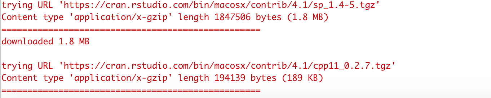

<br />

You may be asked for permission to compile the code for certain pages, type 'Yes' and run the code.

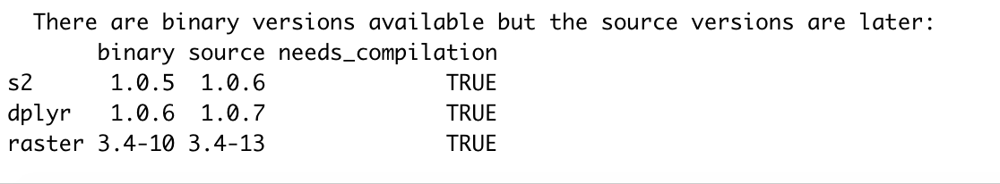


<br />

```{r, results = 'hide', message=FALSE, warning=FALSE, eval=FALSE, echo=TRUE}
Yes
```

If the installation was successful, you should see something similar to the following:

```
─  preparing ‘Spectre’: (879ms)
✓  checking DESCRIPTION meta-information ...
─  checking for LF line-endings in source and make files and shell scripts
─  checking for empty or unneeded directories
─  building ‘Spectre_1.1.0.tar.gz’
    
* installing *source* package ‘Spectre’ ...
** using staged installation
** R
** data
*** moving datasets to lazyload DB
** inst
** byte-compile and prepare package for lazy loading
** help
*** installing help indices
** building package indices
** testing if installed package can be loaded from temporary location
** testing if installed package can be loaded from final location
** testing if installed package keeps a record of temporary installation path
* DONE (Spectre)
```

You can check on the status of Spectre and the other package dependencies by running the `package.check()` command.

```{r, results = 'hide', message=FALSE, warning=FALSE, eval=FALSE, echo=TRUE}
package.check()
```

```
Package: Spectre
 -- Version:           1.1.0
 -- Install date:      2024-05-19
 -- Install source:    github
 -- R version:         R version 4.4.0 (2024-04-24)
 -- OS:                macOS Ventura 13.5.2
 -- OS detail:         aarch64-apple-darwin20
 -- Library path(s):      
        /Users/thomasa/Library/R/arm64/4.4/library
        /Library/Frameworks/R.framework/Versions/4.4-arm64/Resources/library
               
Checking dependency packages...
 -- All packages successfully installed.
               
Check out 'https://immunedynamics.github.io/spectre/' for protocols
```

<br />

#### Updating Spectre

To update to the latest version, simply run the installation code above. If you have the latest version installed, R will not install it again. If you have an older version, the R will install the latest version. If you wish, you can check the [Spectre Home Page](https://immunedynamics.github.io/spectre) for the latest version. 

To see if you have Spectre installed, you can open RStudio and look under the 'packages' tab. The version will be listed in the right hand column. Hit the  refresh button to refresh the package list if you need. 

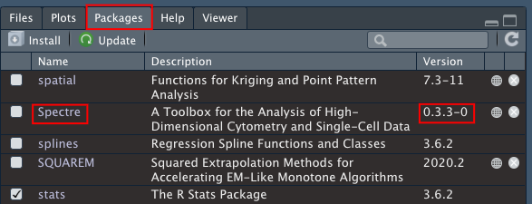

You can also run `Spectre::package.check()` to get information on the version you have installed.

```{r, results = 'hide', message=FALSE, warning=FALSE, eval=FALSE, echo=TRUE}
Spectre::package.check()
```

```
Package: Spectre
 -- Version:           1.1.0
 -- Install date:      2024-05-19
 -- Install source:    github
 -- R version:         R version 4.4.0 (2024-04-24)
 -- OS:                macOS Ventura 13.5.2
 -- OS detail:         aarch64-apple-darwin20
 -- Library path(s):      
        /Users/thomasa/Library/R/arm64/4.4/library
        /Library/Frameworks/R.framework/Versions/4.4-arm64/Resources/library
               
Checking dependency packages...
 -- All packages successfully installed.
               
Check out 'https://immunedynamics.github.io/spectre/' for protocols
```

<br />

#### Troubleshooting

If Spectre or any of the dependencies was not installed successfully, you may see some error messages like the following.


Alternatively, if Spectre was successfully installed, but when running 'package.check()' some of the dependencies were not been installed correctly, you will see something like the following:

```
Checking dependency packages...
 -- Biobase is required but not installed. Please install from BioConductor.
                
Check out 'https://immunedynamics.github.io/spectre/getting-started/' for help with installation
```

In this case, try install the offending packages independently. Note whether the packages need to be installed from CRAN or Bioconductor. Alternatively, you can [report an issue on Github](https://github.com/ImmuneDynamics/Spectre/issues), ask for help on our [discussion board](https://github.com/ImmuneDynamics/Spectre/discussions), or [email us](thomas.ashhurst@sydney.edu.au).

<br />
<br />


## Installing via Docker

------------------------------------------------------------------------

Spectre is available as a Docker container, thanks to the efforts of Dr. Givanna Putri. Docker is a cloud service that allows anyone to deliver software packages as a "complete unit" in a form of container. What this means is that the software package is released as a standalone computing environment, pre-installed with necessary pre-requisite libraries required by the software, and pre-configured for user convenience. Spectre's Docker image will match the most recent versions of Spectre (denoted as 'master', referring to the master branch in Github). To download this version, simply follow the instructions below. If you wish to load a specific version of Spectre, you can specify a version (e.g. v0.5.3, v0.5.4. etc) instead of using 'master'. You can see a list of versions available via docker on [this page](https://hub.docker.com/r/immunedynamics/spectre/tags).

#### Download Docker desktop app

Go to the following address: [
https://www.docker.com/products/docker-desktop](
https://www.docker.com/products/docker-desktop)

Download the correct version of Docker Desktop.

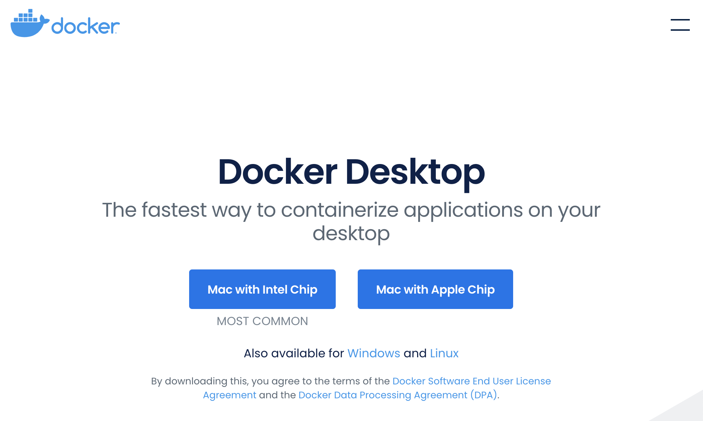

Go to your downloads folder and open the '.dmg' file.


When the following window opens, drag and drop the 'Docker.app' icon into the 'Applications' shortcut.


You should now be able to find 'Docker' in your applications folder.

<br />

#### Set some preferences (optional)

Open Docker app from the applications folder or bar at the bottom of the screen. 

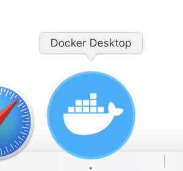

Once you turn it on, you should see the following icon in the bar at the top of the screen.

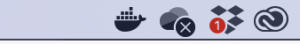

Additionally the program itself should open. Wait a few moments while the 'Docker Engine' starts.


The icon in the lower left will turn green when ready.


Click the gears icon to open 'preferences'. Make sure you untick the options in General to mimic the screenshot below. This is to ensure Docker doesn't start when you boot your computer, and it doesn't share your usage data to Docker by default. Leave the automatic update checked if you prefer it to check for updates regularly.


Press 'Apply & Restart' when done. Close app until you would like to use it.

<br />

#### Launching Docker

Open the Docker app.


Wait a few moments while the 'Docker Engine' starts.

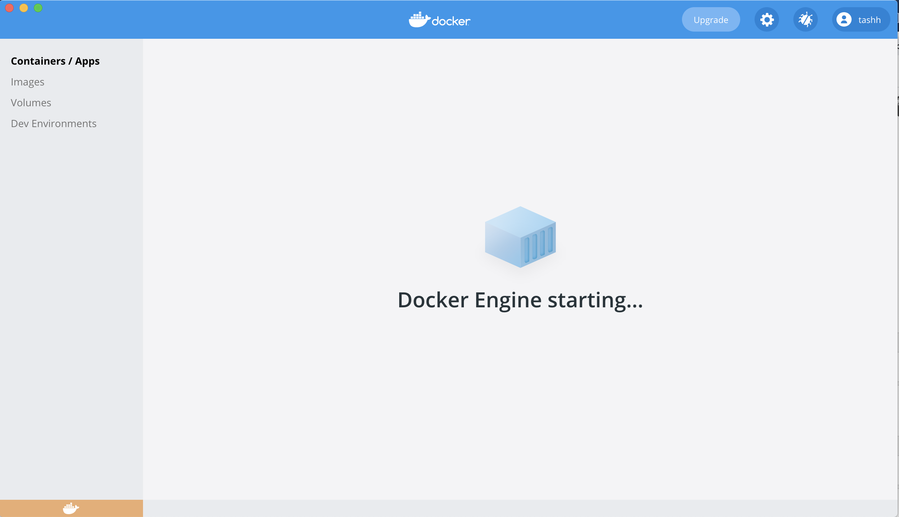

The icon in the lower left will turn green when ready.


Open 'Terminal' (on Mac, can be found in the applications folder, or the bar at the bottom of your screen).

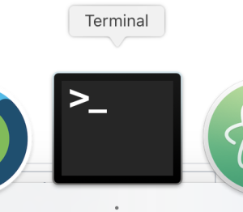


Copy the following code into the terminal and press ENTER.

```
docker run --rm -e PASSWORD=spectre -p 8787:8787 -v ~:/home/rstudio/spectre_dir --name=spectre immunedynamics/spectre:master
```


By default, the RStudio session that Docker will launch will be able to see everything in your Home directory and below. This is achieved in the code above using the '~' symbol. If you have data elsewhere (on a server etc) you can navigate to that location using Finger and drag + drop the target directory/folder into terminal:

In terminal, add the following segments, and then hit ENTER:

1. docker run --rm -e PASSWORD=spectre -p 8787:8787 -v 
2. DRAG+DROP the target folder from finder
3. :/home/rstudio/spectre_dir --name=spectre immunedynamics/spectre:master

Open your preferred web browser (chrome, safari, etc) and go to the following address 

[http://localhost:8787](http://localhost:8787)

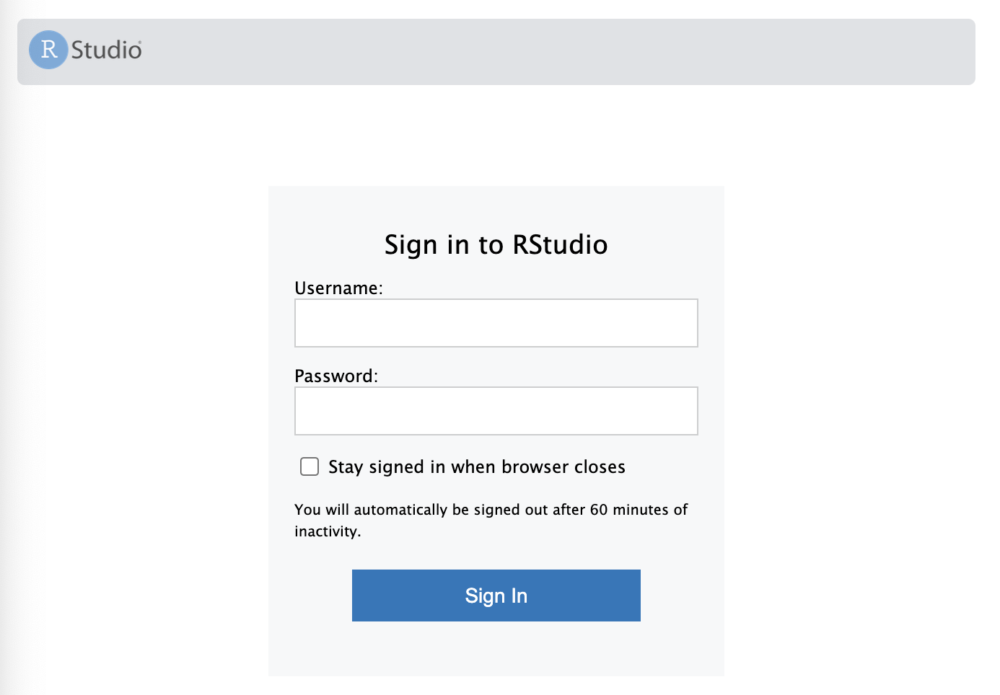

Sign in

- Name: rstudio
- Password: spectre

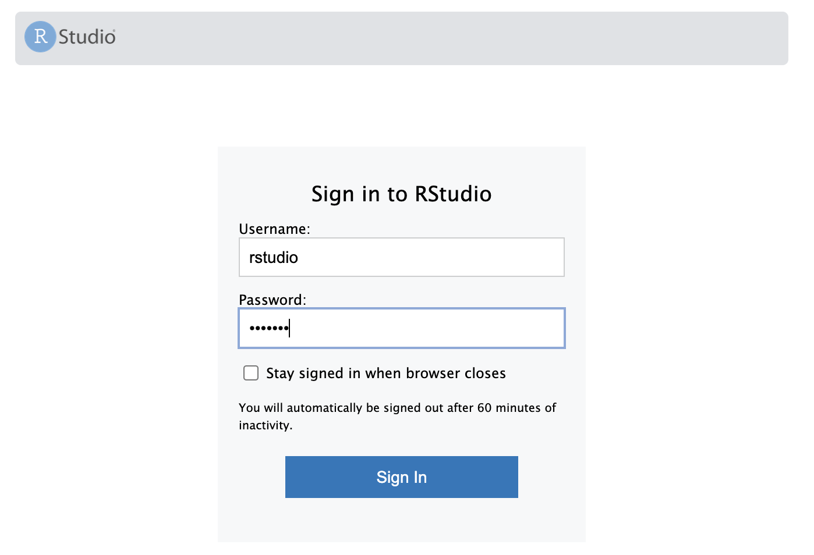

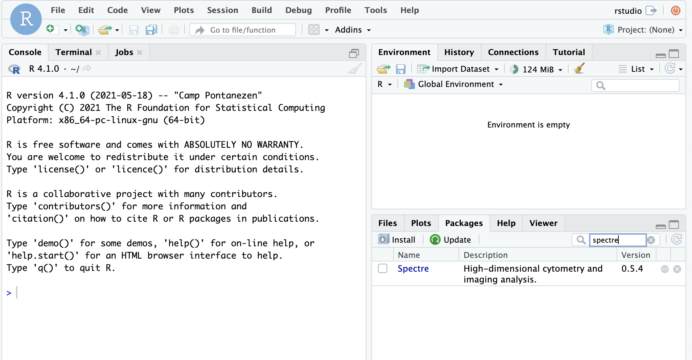

#### Running Spectre

Open desired analysis script


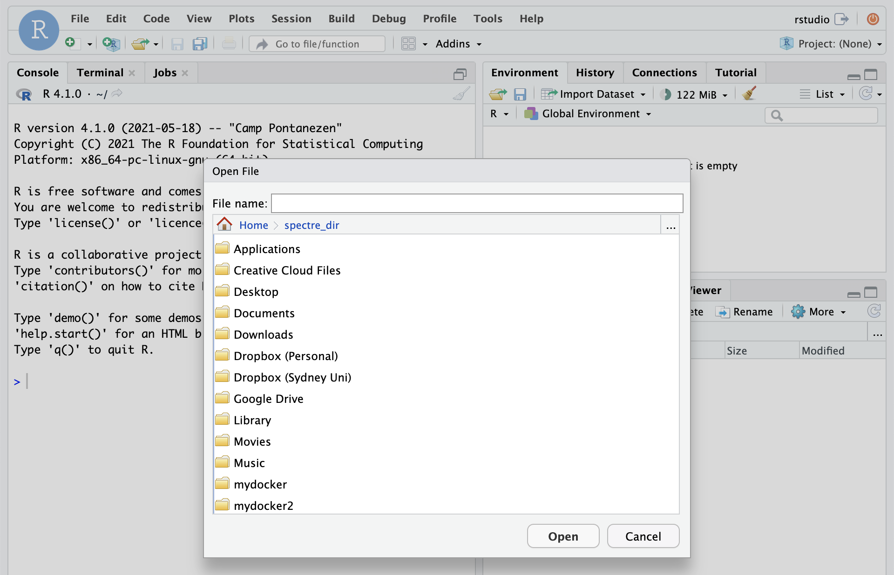


Perform analysis

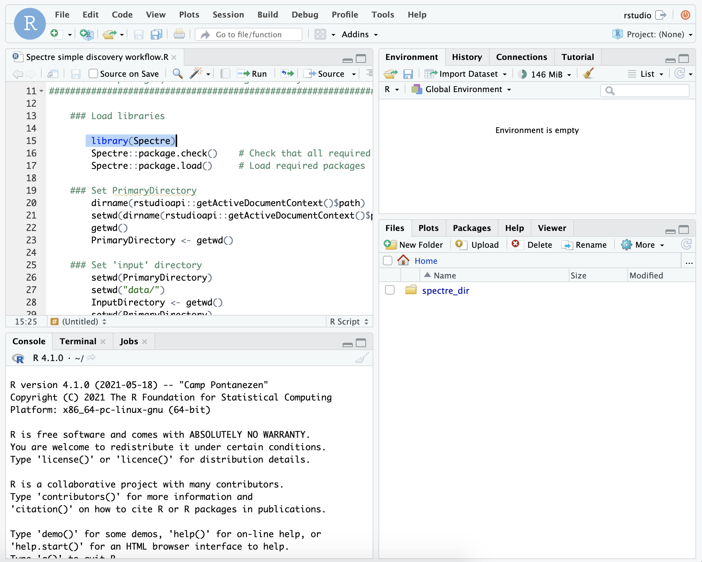

Close when finished


<br />
<br />


