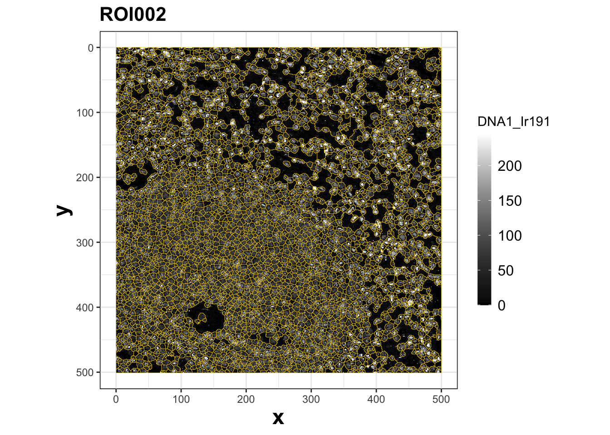
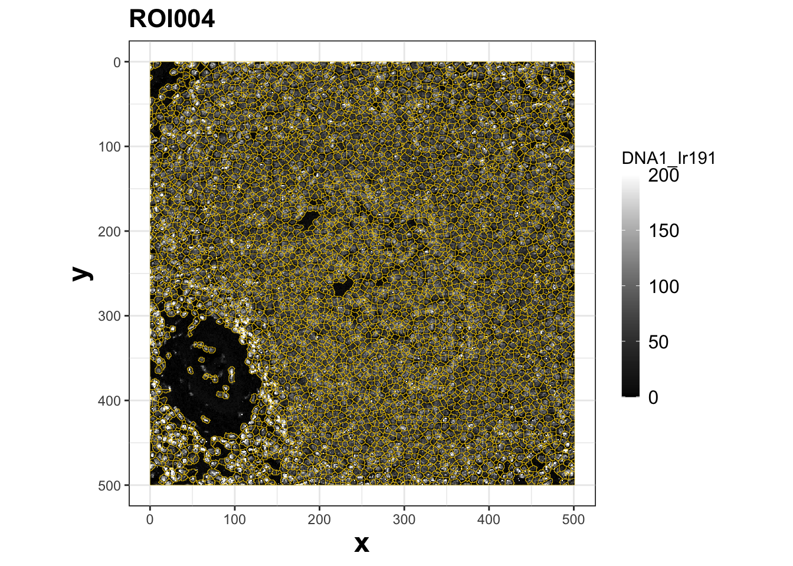
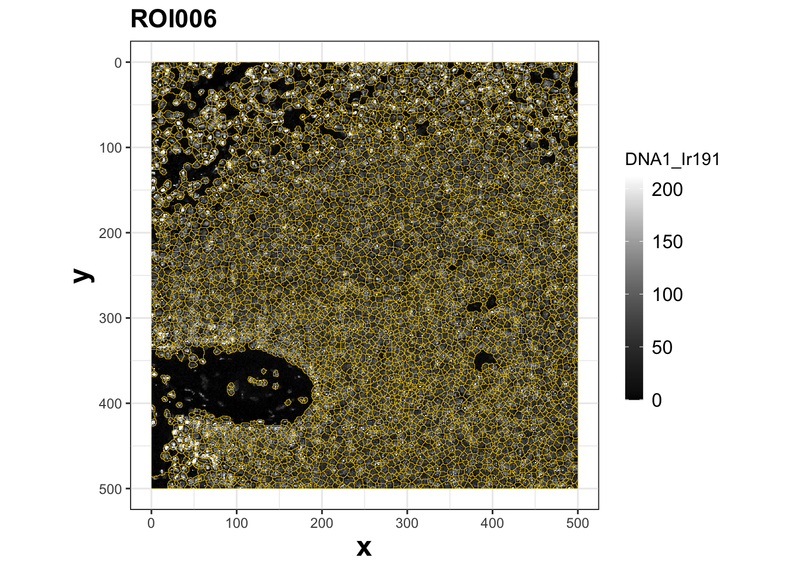
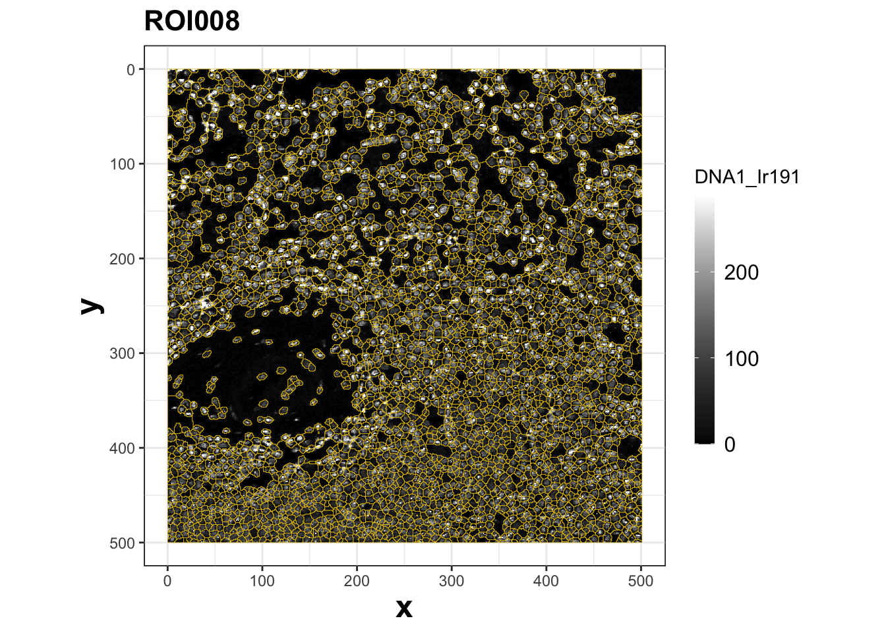
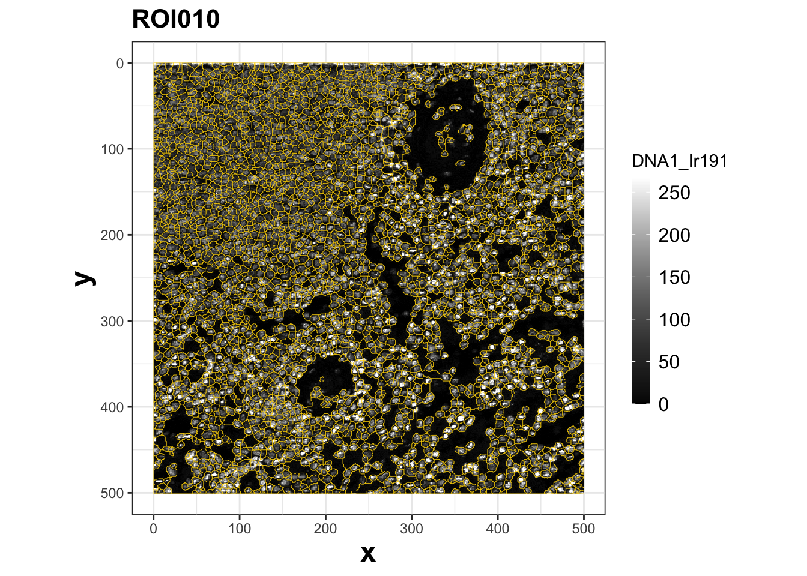
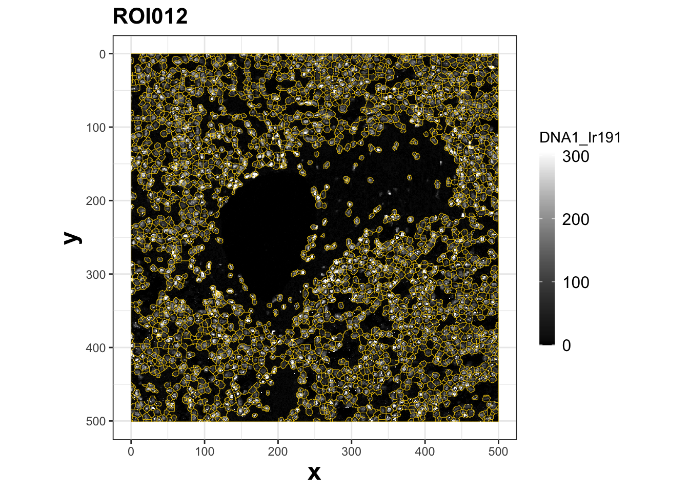

---

**[<- Back to Spectre home page](https://immunedynamics.io/spectre)**

<br />
<br />


## Introduction

---

This tutorial introduces the user to manipulating and analysing IMC data using FlowJo, following segmentation and pre-processing using one of Spectre's [segmentation approaches](https://immunedynamics.io/spectre/spatial/). This provides a straightforward method for quantifying cellular expression and frequency data derived from segmented images. 

**Key preparation steps via Spectre**

1. Arcsinh transformation. To prepare the data for analysis, the raw values are subject to arcsinh transformation with a co-factor of 1. These channels are indicated by the "_asinh" that is appended to the end of the channel name. These can be plotted on a linear axis typically between 0 and ~5.

2. Y-axis inversion. Programs such as HistoCat that typically deal with imaging data position x=0, y=0 in the top left corner. Programs that deal with numerical data, such as FlowJo, typically position x=0, y=0 in the bottom left corner. The result of this is that IMC images tend to be 'flipped' on the Y-axis. A key modification to the data within this R script is the addition of a second 'Y-axis' column, where the values are converted to negative. By doing this, FlowJo can render the image in the correct orientation.


<br />
<br />


## 1. Generate FCS files using R

---

Following the use of one of [Spectre's segmentation approaches](https://immunedynamics.io/spectre/spatial/), you can use an R script to convert TIFF files and masks into FCS files, for use in FlowJo. You can find the script here on the [Spectre Github](https://github.com/ImmuneDynamics/Spectre):

```
workflows/Spatial - FlowJo/Spectre TIFF to FCS/
```

### Script and data

Organise your folders and data like this:

1. Script:


2. ROI TIFFs:


3. Masks


4. ROI metadata


<br />


### Run script in R


```r
###################################################################################
### Spectre: TIFF to FCS
###################################################################################
```


```r
        ### Load libraries
        
        library('Spectre')
        
        Spectre::package.check(type = 'spatial')
        Spectre::package.load(type = 'spatial')
```


```r
        ### Set PrimaryDirectory
        
        dirname(rstudioapi::getActiveDocumentContext()$path)            # Finds the directory where this script is located
        setwd(dirname(rstudioapi::getActiveDocumentContext()$path))     # Sets the working directory to where the script is located
        getwd()
        PrimaryDirectory <- getwd()
        PrimaryDirectory
```


```r
        ### Set InputDirectory (ROI TIFFs)
        
        setwd(PrimaryDirectory)
        setwd("../data/ROIs/")
        InputDirectory <- getwd()
        InputDirectory
```

```
## [1] "/Users/thomasa/OneDrive - The University of Sydney (Staff)/Library/Github (public)/Spectre/workflows/Spatial - FlowJo/data/ROIs"
```


```r
        setwd(PrimaryDirectory)
        setwd("../data/masks")
        MaskDirectory <- getwd()
        MaskDirectory
```

```
## [1] "/Users/thomasa/OneDrive - The University of Sydney (Staff)/Library/Github (public)/Spectre/workflows/Spatial - FlowJo/data/masks"
```


```r
        ### Create output directory
        
        setwd(PrimaryDirectory)
        dir.create("Output - TIFF to FCS")
        setwd("Output - TIFF to FCS")
        OutputDirectory <- getwd()
        OutputDirectory
```

```
## [1] "/Users/thomasa/OneDrive - The University of Sydney (Staff)/Library/Github (public)/Spectre/workflows/Spatial - FlowJo/Spectre TIFF to FCS/Output - TIFF to FCS"
```


```r
###################################################################################
### Check ROIs and TIFFs
###################################################################################
```


```r
        ### Initialise the spatial data object with channel TIFF files
        
        setwd(InputDirectory)
        
        rois <- list.dirs(full.names = FALSE, recursive = FALSE)
        as.matrix(rois)
```

```
##      [,1]    
## [1,] "ROI002"
## [2,] "ROI004"
## [3,] "ROI006"
## [4,] "ROI008"
## [5,] "ROI010"
## [6,] "ROI012"
```


```r
        ### Check channel names
        
        tiff.list <- list()
        
        for(i in rois){
            setwd(InputDirectory)
            setwd(i)
            tiff.list[[i]] <- list.files(getwd())
        }
        
        t(as.data.frame(tiff.list))
```

```
##        [,1]               [,2]              [,3]             [,4]            
## ROI002 "CD11b_Sm149.tiff" "CD20_Dy161.tiff" "CD3_Er170.tiff" "CD4_Gd156.tiff"
## ROI004 "CD11b_Sm149.tiff" "CD20_Dy161.tiff" "CD3_Er170.tiff" "CD4_Gd156.tiff"
## ROI006 "CD11b_Sm149.tiff" "CD20_Dy161.tiff" "CD3_Er170.tiff" "CD4_Gd156.tiff"
## ROI008 "CD11b_Sm149.tiff" "CD20_Dy161.tiff" "CD3_Er170.tiff" "CD4_Gd156.tiff"
## ROI010 "CD11b_Sm149.tiff" "CD20_Dy161.tiff" "CD3_Er170.tiff" "CD4_Gd156.tiff"
## ROI012 "CD11b_Sm149.tiff" "CD20_Dy161.tiff" "CD3_Er170.tiff" "CD4_Gd156.tiff"
##        [,5]              [,6]              [,7]              [,8]             
## ROI002 "CD45_Sm152.tiff" "CD8a_Dy162.tiff" "DNA1_Ir191.tiff" "DNA3_Ir193.tiff"
## ROI004 "CD45_Sm152.tiff" "CD8a_Dy162.tiff" "DNA1_Ir191.tiff" "DNA3_Ir193.tiff"
## ROI006 "CD45_Sm152.tiff" "CD8a_Dy162.tiff" "DNA1_Ir191.tiff" "DNA3_Ir193.tiff"
## ROI008 "CD45_Sm152.tiff" "CD8a_Dy162.tiff" "DNA1_Ir191.tiff" "DNA3_Ir193.tiff"
## ROI010 "CD45_Sm152.tiff" "CD8a_Dy162.tiff" "DNA1_Ir191.tiff" "DNA3_Ir193.tiff"
## ROI012 "CD45_Sm152.tiff" "CD8a_Dy162.tiff" "DNA1_Ir191.tiff" "DNA3_Ir193.tiff"
```


```r
###################################################################################
### Read in TIFF files and create spatial objects
###################################################################################  
```


```r
        ### Read in ROI channel TIFFs
        
        setwd(InputDirectory)
        spatial.dat <- read.spatial.files(dir = InputDirectory)
```


```r
        ### Check results
        
        str(spatial.dat, 3)
```

```
## List of 6
##  $ ROI002:Formal class 'spatial' [package "Spectre"] with 3 slots
##   .. ..@ RASTERS:Formal class 'RasterStack' [package "raster"] with 11 slots
##   .. ..@ MASKS  : list()
##   .. ..@ DATA   : list()
##  $ ROI004:Formal class 'spatial' [package "Spectre"] with 3 slots
##   .. ..@ RASTERS:Formal class 'RasterStack' [package "raster"] with 11 slots
##   .. ..@ MASKS  : list()
##   .. ..@ DATA   : list()
##  $ ROI006:Formal class 'spatial' [package "Spectre"] with 3 slots
##   .. ..@ RASTERS:Formal class 'RasterStack' [package "raster"] with 11 slots
##   .. ..@ MASKS  : list()
##   .. ..@ DATA   : list()
##  $ ROI008:Formal class 'spatial' [package "Spectre"] with 3 slots
##   .. ..@ RASTERS:Formal class 'RasterStack' [package "raster"] with 11 slots
##   .. ..@ MASKS  : list()
##   .. ..@ DATA   : list()
##  $ ROI010:Formal class 'spatial' [package "Spectre"] with 3 slots
##   .. ..@ RASTERS:Formal class 'RasterStack' [package "raster"] with 11 slots
##   .. ..@ MASKS  : list()
##   .. ..@ DATA   : list()
##  $ ROI012:Formal class 'spatial' [package "Spectre"] with 3 slots
##   .. ..@ RASTERS:Formal class 'RasterStack' [package "raster"] with 11 slots
##   .. ..@ MASKS  : list()
##   .. ..@ DATA   : list()
```

```r
        spatial.dat[[1]]@RASTERS
```

```
## class      : RasterStack 
## dimensions : 501, 500, 250500, 8  (nrow, ncol, ncell, nlayers)
## resolution : 1, 1  (x, y)
## extent     : 0, 500, 0, 501  (xmin, xmax, ymin, ymax)
## crs        : NA 
## names      : CD11b_Sm149, CD20_Dy161, CD3_Er170, CD4_Gd156, CD45_Sm152, CD8a_Dy162, DNA1_Ir191, DNA3_Ir193 
## min values :           0,          0,         0,         0,          0,          0,          0,          0 
## max values :          33,        779,        41,        40,        734,        109,       1670,       3007
```


```r
###################################################################################
### Read in masks files
###################################################################################
```


```r
        ### Define cell mask extension for different mask types
        
        setwd(MaskDirectory)
        
        all.masks <- list.files(pattern = '.tif')
        as.matrix(all.masks)
```

```
##       [,1]                                       
##  [1,] "ROI002_ilastik_s2_Object Identities.tif"  
##  [2,] "ROI002_ilastik_s2_Object Predictions.tif" 
##  [3,] "ROI002_ilastik_s2_Simple Segmentation.tif"
##  [4,] "ROI004_ilastik_s2_Object Identities.tif"  
##  [5,] "ROI004_ilastik_s2_Object Predictions.tif" 
##  [6,] "ROI004_ilastik_s2_Simple Segmentation.tif"
##  [7,] "ROI006_ilastik_s2_Object Identities.tif"  
##  [8,] "ROI006_ilastik_s2_Object Predictions.tif" 
##  [9,] "ROI006_ilastik_s2_Simple Segmentation.tif"
## [10,] "ROI008_ilastik_s2_Object Identities.tif"  
## [11,] "ROI008_ilastik_s2_Object Predictions.tif" 
## [12,] "ROI008_ilastik_s2_Simple Segmentation.tif"
## [13,] "ROI010_ilastik_s2_Object Identities.tif"  
## [14,] "ROI010_ilastik_s2_Object Predictions.tif" 
## [15,] "ROI010_ilastik_s2_Simple Segmentation.tif"
## [16,] "ROI012_ilastik_s2_Object Identities.tif"  
## [17,] "ROI012_ilastik_s2_Object Predictions.tif" 
## [18,] "ROI012_ilastik_s2_Simple Segmentation.tif"
```

```r
        mask.types <- list('cell.mask' = '_ilastik_s2_Object Identities.tif',
                           'cell.type' = '_ilastik_s2_Object Predictions.tif',
                           'region' = '_ilastik_s2_Simple Segmentation.tif')
        mask.types
```

```
## $cell.mask
## [1] "_ilastik_s2_Object Identities.tif"
## 
## $cell.type
## [1] "_ilastik_s2_Object Predictions.tif"
## 
## $region
## [1] "_ilastik_s2_Simple Segmentation.tif"
```


```r
        ### Read in masks
        
        for(i in names(mask.types)){
            spatial.dat <- do.add.masks(dat = spatial.dat, 
                                        mask.dir = MaskDirectory, 
                                        mask.pattern = mask.types[[i]], 
                                        mask.label = i)
        }
        
        str(spatial.dat, 3)
```

```
## List of 6
##  $ ROI002:Formal class 'spatial' [package "Spectre"] with 3 slots
##   .. ..@ RASTERS:Formal class 'RasterStack' [package "raster"] with 11 slots
##   .. ..@ MASKS  :List of 3
##   .. ..@ DATA   : list()
##  $ ROI004:Formal class 'spatial' [package "Spectre"] with 3 slots
##   .. ..@ RASTERS:Formal class 'RasterStack' [package "raster"] with 11 slots
##   .. ..@ MASKS  :List of 3
##   .. ..@ DATA   : list()
##  $ ROI006:Formal class 'spatial' [package "Spectre"] with 3 slots
##   .. ..@ RASTERS:Formal class 'RasterStack' [package "raster"] with 11 slots
##   .. ..@ MASKS  :List of 3
##   .. ..@ DATA   : list()
##  $ ROI008:Formal class 'spatial' [package "Spectre"] with 3 slots
##   .. ..@ RASTERS:Formal class 'RasterStack' [package "raster"] with 11 slots
##   .. ..@ MASKS  :List of 3
##   .. ..@ DATA   : list()
##  $ ROI010:Formal class 'spatial' [package "Spectre"] with 3 slots
##   .. ..@ RASTERS:Formal class 'RasterStack' [package "raster"] with 11 slots
##   .. ..@ MASKS  :List of 3
##   .. ..@ DATA   : list()
##  $ ROI012:Formal class 'spatial' [package "Spectre"] with 3 slots
##   .. ..@ RASTERS:Formal class 'RasterStack' [package "raster"] with 11 slots
##   .. ..@ MASKS  :List of 3
##   .. ..@ DATA   : list()
```

```r
        str(spatial.dat[[1]]@MASKS, 3)
```

```
## List of 3
##  $ cell.mask:List of 1
##   ..$ maskraster:Formal class 'RasterLayer' [package "raster"] with 12 slots
##  $ cell.type:List of 1
##   ..$ maskraster:Formal class 'RasterLayer' [package "raster"] with 12 slots
##  $ region   :List of 1
##   ..$ maskraster:Formal class 'RasterLayer' [package "raster"] with 12 slots
```


```r
###################################################################################
### Rename rasters (if required)
###################################################################################
```


```r
        ### Check channel names
        
        channel.names <- list()
        
        for(i in names(spatial.dat)){
            channel.names[[i]] <- names(spatial.dat[[i]]@RASTERS)
        }
        
        t(as.data.frame(channel.names))
```

```
##        [,1]          [,2]         [,3]        [,4]        [,5]        
## ROI002 "CD11b_Sm149" "CD20_Dy161" "CD3_Er170" "CD4_Gd156" "CD45_Sm152"
## ROI004 "CD11b_Sm149" "CD20_Dy161" "CD3_Er170" "CD4_Gd156" "CD45_Sm152"
## ROI006 "CD11b_Sm149" "CD20_Dy161" "CD3_Er170" "CD4_Gd156" "CD45_Sm152"
## ROI008 "CD11b_Sm149" "CD20_Dy161" "CD3_Er170" "CD4_Gd156" "CD45_Sm152"
## ROI010 "CD11b_Sm149" "CD20_Dy161" "CD3_Er170" "CD4_Gd156" "CD45_Sm152"
## ROI012 "CD11b_Sm149" "CD20_Dy161" "CD3_Er170" "CD4_Gd156" "CD45_Sm152"
##        [,6]         [,7]         [,8]        
## ROI002 "CD8a_Dy162" "DNA1_Ir191" "DNA3_Ir193"
## ROI004 "CD8a_Dy162" "DNA1_Ir191" "DNA3_Ir193"
## ROI006 "CD8a_Dy162" "DNA1_Ir191" "DNA3_Ir193"
## ROI008 "CD8a_Dy162" "DNA1_Ir191" "DNA3_Ir193"
## ROI010 "CD8a_Dy162" "DNA1_Ir191" "DNA3_Ir193"
## ROI012 "CD8a_Dy162" "DNA1_Ir191" "DNA3_Ir193"
```


```r
        ### List of corrections (first entry is the 'correct' one)
        
        # corrections <- list(c('CD4','Cd4'),
        #                     c('CD8','CD8a')
        #                     )
```


```r
        ### Replace the 'incorrect' names
        
        # for(i in names(spatial.dat)){
        #   # i <- names(spatial.dat)[[1]]
        #   
        #   for(a in c(1:length(corrections))){
        #     # a <- 1
        #     
        #     trg <- which(names(spatial.dat[[i]]@RASTERS) == corrections[[a]][2])
        #     if(length(trg) != 0){
        #       names(spatial.dat[[i]]@RASTERS)[trg] <- corrections[[a]][1]
        #     }
        #   }
        # }
```


```r
        ### Check channel names
        
        # channel.names <- list()
        # 
        # for(i in names(spatial.dat)){
        #   channel.names[[i]] <- names(spatial.dat[[i]]@RASTERS)
        # }
        # 
        # t(as.data.frame(channel.names))     
```


```r
###################################################################################
### Generate polygons and outlines
###################################################################################
```


```r
        ### Generate polygons and outlines
        
        for(i in names(spatial.dat[[1]]@MASKS)){
            spatial.dat <- do.create.outlines(dat = spatial.dat, mask.name = i)
        }
```


```r
        ### Checks
        
        str(spatial.dat, 3)
```

```
## List of 6
##  $ ROI002:Formal class 'spatial' [package "Spectre"] with 3 slots
##   .. ..@ RASTERS:Formal class 'RasterStack' [package "raster"] with 11 slots
##   .. ..@ MASKS  :List of 3
##   .. ..@ DATA   : list()
##  $ ROI004:Formal class 'spatial' [package "Spectre"] with 3 slots
##   .. ..@ RASTERS:Formal class 'RasterStack' [package "raster"] with 11 slots
##   .. ..@ MASKS  :List of 3
##   .. ..@ DATA   : list()
##  $ ROI006:Formal class 'spatial' [package "Spectre"] with 3 slots
##   .. ..@ RASTERS:Formal class 'RasterStack' [package "raster"] with 11 slots
##   .. ..@ MASKS  :List of 3
##   .. ..@ DATA   : list()
##  $ ROI008:Formal class 'spatial' [package "Spectre"] with 3 slots
##   .. ..@ RASTERS:Formal class 'RasterStack' [package "raster"] with 11 slots
##   .. ..@ MASKS  :List of 3
##   .. ..@ DATA   : list()
##  $ ROI010:Formal class 'spatial' [package "Spectre"] with 3 slots
##   .. ..@ RASTERS:Formal class 'RasterStack' [package "raster"] with 11 slots
##   .. ..@ MASKS  :List of 3
##   .. ..@ DATA   : list()
##  $ ROI012:Formal class 'spatial' [package "Spectre"] with 3 slots
##   .. ..@ RASTERS:Formal class 'RasterStack' [package "raster"] with 11 slots
##   .. ..@ MASKS  :List of 3
##   .. ..@ DATA   : list()
```

```r
        str(spatial.dat[[1]]@MASKS, 2)
```

```
## List of 3
##  $ cell.mask:List of 4
##   ..$ maskraster:Formal class 'RasterLayer' [package "raster"] with 12 slots
##   ..$ polygons  :Formal class 'SpatialPolygonsDataFrame' [package "sp"] with 5 slots
##   ..$ outlines  :'data.frame':	102730 obs. of  7 variables:
##   ..$ centroids :Formal class 'SpatialPoints' [package "sp"] with 3 slots
##  $ cell.type:List of 4
##   ..$ maskraster:Formal class 'RasterLayer' [package "raster"] with 12 slots
##   ..$ polygons  :Formal class 'SpatialPolygonsDataFrame' [package "sp"] with 5 slots
##   ..$ outlines  :'data.frame':	23699 obs. of  7 variables:
##   ..$ centroids :Formal class 'SpatialPoints' [package "sp"] with 3 slots
##  $ region   :List of 4
##   ..$ maskraster:Formal class 'RasterLayer' [package "raster"] with 12 slots
##   ..$ polygons  :Formal class 'SpatialPolygonsDataFrame' [package "sp"] with 5 slots
##   ..$ outlines  :'data.frame':	8452 obs. of  7 variables:
##   ..$ centroids :Formal class 'SpatialPoints' [package "sp"] with 3 slots
```


```r
###################################################################################
### Mask QC plots
###################################################################################    
```


```r
        ### Mask plot setup
        
        setwd(OutputDirectory)
        dir.create('Plots - cell masks')
        setwd('Plots - cell masks')
        
        as.matrix(names(spatial.dat[[1]]@RASTERS))
```

```
##      [,1]         
## [1,] "CD11b_Sm149"
## [2,] "CD20_Dy161" 
## [3,] "CD3_Er170"  
## [4,] "CD4_Gd156"  
## [5,] "CD45_Sm152" 
## [6,] "CD8a_Dy162" 
## [7,] "DNA1_Ir191" 
## [8,] "DNA3_Ir193"
```

```r
        base <- 'DNA1_Ir191'
        base
```

```
## [1] "DNA1_Ir191"
```

```r
        as.matrix(names(spatial.dat[[1]]@MASKS))
```

```
##      [,1]       
## [1,] "cell.mask"
## [2,] "cell.type"
## [3,] "region"
```

```r
        mask <- 'cell.mask'
        mask  
```

```
## [1] "cell.mask"
```


```r
        ### Create plots
        
        for(i in names(spatial.dat)){
            make.spatial.plot(dat = spatial.dat, 
                              image.roi = i, 
                              image.channel = base, 
                              mask.outlines = mask)
        }
```




```r
###################################################################################
### Calculate cellular data and plot
###################################################################################
```


```r
        ### Calculate cellular data for each cell mask (this step may take some time)
        
        spatial.dat <- do.extract(spatial.dat, 'cell.mask')
```


```r
        str(spatial.dat, 3)
```

```
## List of 6
##  $ ROI002:Formal class 'spatial' [package "Spectre"] with 3 slots
##   .. ..@ RASTERS:Formal class 'RasterStack' [package "raster"] with 11 slots
##   .. ..@ MASKS  :List of 3
##   .. ..@ DATA   :List of 1
##  $ ROI004:Formal class 'spatial' [package "Spectre"] with 3 slots
##   .. ..@ RASTERS:Formal class 'RasterStack' [package "raster"] with 11 slots
##   .. ..@ MASKS  :List of 3
##   .. ..@ DATA   :List of 1
##  $ ROI006:Formal class 'spatial' [package "Spectre"] with 3 slots
##   .. ..@ RASTERS:Formal class 'RasterStack' [package "raster"] with 11 slots
##   .. ..@ MASKS  :List of 3
##   .. ..@ DATA   :List of 1
##  $ ROI008:Formal class 'spatial' [package "Spectre"] with 3 slots
##   .. ..@ RASTERS:Formal class 'RasterStack' [package "raster"] with 11 slots
##   .. ..@ MASKS  :List of 3
##   .. ..@ DATA   :List of 1
##  $ ROI010:Formal class 'spatial' [package "Spectre"] with 3 slots
##   .. ..@ RASTERS:Formal class 'RasterStack' [package "raster"] with 11 slots
##   .. ..@ MASKS  :List of 3
##   .. ..@ DATA   :List of 1
##  $ ROI012:Formal class 'spatial' [package "Spectre"] with 3 slots
##   .. ..@ RASTERS:Formal class 'RasterStack' [package "raster"] with 11 slots
##   .. ..@ MASKS  :List of 3
##   .. ..@ DATA   :List of 1
```

```r
        spatial.dat[[1]]@DATA
```

```
## $CellData
##         ID          x          y Area CD11b_Sm149 CD20_Dy161 CD3_Er170
##    1:    1 147.666667 500.166667    6  0.33333334 10.1666670 0.3333333
##    2:    2  97.000000 500.000000   16  0.37500000  1.3750000 0.5000000
##    3:    3 470.815789 499.710526   19  0.57894737  0.1052632 0.2631579
##    4:    4 310.500000 499.833333   12  0.08333334 60.5833321 0.2500000
##    5:    5 245.166667 499.833333   12  0.33333334 28.2500000 2.0000000
##   ---                                                                 
## 4220: 4220  28.839623   5.122642   53  0.20754717  0.6226415 0.1509434
## 4221: 4221  21.800000   2.125000   40  0.47499999  1.0250000 0.3000000
## 4222: 4222  14.227273   2.136364   22  0.13636364  1.3181819 0.2272727
## 4223: 4223   7.400000   1.250000   20  0.44999999  1.5000000 0.8500000
## 4224: 4224   2.816667   5.933333   60  0.73333335  6.5833335 2.6500001
##       CD4_Gd156 CD45_Sm152 CD8a_Dy162 DNA1_Ir191 DNA3_Ir193 cell.type region
##    1: 0.0000000  5.6666665  0.5000000  54.666668   98.50000     65534  65535
##    2: 1.7500000  1.8125000  0.8125000   9.750000   15.62500     65534  65534
##    3: 0.7368421  0.2631579  0.6842105   8.578947   16.31579     65534  65534
##    4: 0.1666667  7.0833335  1.5833334  50.833332  104.41666     65534  65535
##    5: 0.0000000 18.6666660  4.2500000  95.916664  171.58333     65534  65535
##   ---                                                                       
## 4220: 0.5660377  0.2641509  0.3773585  77.188683  139.83018     65534  65534
## 4221: 0.3250000  1.7500000  0.5250000 104.875000  191.05000     65534  65534
## 4222: 0.3181818  1.8636364  1.5454545   5.545455   10.09091     65534  65534
## 4223: 0.9500000  2.6500001  3.3000000  64.150002  115.50000     65534  65534
## 4224: 0.9000000  6.4333334  5.2500000  58.933334  107.05000     65534  65534
```

```r
        all.dat <- do.pull.data(spatial.dat, 'CellData')
        all.dat     
```

```
##           ROI   ID          x          y Area CD11b_Sm149 CD20_Dy161 CD3_Er170
##     1: ROI002    1 147.666667 500.166667    6  0.33333334 10.1666670 0.3333333
##     2: ROI002    2  97.000000 500.000000   16  0.37500000  1.3750000 0.5000000
##     3: ROI002    3 470.815789 499.710526   19  0.57894737  0.1052632 0.2631579
##     4: ROI002    4 310.500000 499.833333   12  0.08333334 60.5833321 0.2500000
##     5: ROI002    5 245.166667 499.833333   12  0.33333334 28.2500000 2.0000000
##    ---                                                                        
## 25348: ROI012 2907  45.569767   2.081395   43  0.34883720  3.6744187 0.5581396
## 25349: ROI012 2908  36.675676   4.500000   74  0.27027026  0.8918919 1.9459460
## 25350: ROI012 2909  27.035714   2.446429   56  0.32142857  0.5357143 0.3571429
## 25351: ROI012 2910  16.928571   2.128571   35  0.45714286  0.9142857 1.3428571
## 25352: ROI012 2911   5.986486  10.918919  222  0.31081080  0.7567568 0.2027027
##        CD4_Gd156 CD45_Sm152 CD8a_Dy162 DNA1_Ir191 DNA3_Ir193 cell.type region
##     1: 0.0000000  5.6666665  0.5000000  54.666668   98.50000     65534  65535
##     2: 1.7500000  1.8125000  0.8125000   9.750000   15.62500     65534  65534
##     3: 0.7368421  0.2631579  0.6842105   8.578947   16.31579     65534  65534
##     4: 0.1666667  7.0833335  1.5833334  50.833332  104.41666     65534  65535
##     5: 0.0000000 18.6666660  4.2500000  95.916664  171.58333     65534  65535
##    ---                                                                       
## 25348: 0.5581396  2.0465117  0.9767442  52.651161   99.34884     65534  65534
## 25349: 0.4324324  7.4594593  3.1216216  61.621620  115.50000     65534  65534
## 25350: 1.1964285  1.3214285  1.0892857  95.482140  173.32143     65534  65534
## 25351: 1.4571428  3.2285714  0.6000000  65.428574  122.00000     65534  65534
## 25352: 0.8693694  0.5855856  0.9729730   7.554054   14.17117     65535  65533
```


```r
###################################################################################
### Save data
###################################################################################       
```


```r
        ### Output QS and CSV file
        
        setwd(OutputDirectory)
        dir.create('Data')
        setwd('Data')
        
        qsave(spatial.dat, "spatial.dat.qs")
        fwrite(all.dat, 'all.dat.csv')
```


```r
### Pull cellular data and write FCS file from each ROI independently
        
        setwd(OutputDirectory)
        dir.create('FCS files')
        setwd('FCS files')
        
        for(i in names(spatial.dat)){
            
            ## Extract data and setup cols
            
            tmp <- list()
            tmp[[i]] <- spatial.dat[[i]]
            
            cell.dat <- do.pull.data(tmp, 'CellData')
            cell.dat <- do.asinh(cell.dat, names(spatial.dat[[i]]@RASTERS), cofactor = 1)
            
            ### Invert y axis
            
            all.neg <- function(test) -1*abs(test)
            
            y_invert <- cell.dat[['y']]
            y_invert <- all.neg(y_invert)
            cell.dat[['y_invert']] <- y_invert
            
            ### Write FCS files  
            
            write.files(cell.dat, i, write.csv = FALSE, write.fcs = TRUE)
            rm(cell.dat)
            rm(i)
        }
```

<br />
<br />


## 2. Importing FCS files into FlowJo

---


The FCS files generated by Spectre include a file with all cells, and then one file per ROI. Depending on the exact setup, other combinations may be included. The files for each ROI will be the main files we work with.


Drag and drop these files into a FlowJo workspace, and save.


<br />
<br />


## 3. Axis settings

---

The first thing we will need to do is adapt the axis settings. 


<br />

### X & Y parameters

First, choose the X & Y axis parameters.


Using the 'T' button, select 'Customize Axis'.


Select both the X and Y parameters, and set them to linear. You can select the range using the + and - buttons. This will depend on the size of the ROI. In this demo dataset, the width and heigh of each ROI is 500 (um). You will need to set this range based on the largest ROI.


You can cycle through the files using the left and right green arrows.


If the files were processed in Spectre, there will be an additional 'y-invert' parameter. 


As above, customise the axis and set it to linear. In this case, you will need to use the +/- buttons to set the range from 0 to the negative maximum range (e.g. 0 to -500).


If you compare the 'y' parameter (left) vs the 'y_invert' parameter (right), you will see that they are inverted.


<br />

**Raw data**

For the raw data channels (i.e. the channels that are not arcsinh transformed) we recommend using a log setting between ~10^-1 and 10^2. 


### Arcsinh transformed data

For arcsinh transformed data (channels ending in '_asinh'), we recommend setting the channels to linear, with a range of approx 0 to 5. This cane be tailored for each channel as required.


<br />
<br />


## 4. Gating

---

Gating can be performed on segmented IMC data, much like with normal cytometry data. However, there are a number of important considerations that need to be taken into account. Here we will address these issues in the red boxes.

You can compare the channels across each ROI, to see how consistent they are.


Gates can be drawn as with typical cytometry data. And can be copied to the 'group' to apply the gates to all samples in that group.


<br />


### Creating overlays

Overlays of gated populations can be created, one per ROI. To do this, drag the ROI file onto the layout editor.


Next, drag the gated populations ontop of that plot. 


Repeat for each ROI separately.


You can then adjust the X and Y paramters to be either cellular parameters (above) or the X and Y (y-invert) coordinates (below).


To help with visualisation, you can RIGHT CLICK on each plot individually, and turn 'Use Large Dots' ON.


These plots can be compared directly to the IMC images (e.g. CD20 image coloured in white below).


<br />


### Interpreting spatial plots

Gating IMC data: because of the physical overlap of cells in the IMC images, many markers may 'bleed' from one cell into another. For example, in this plot there are CD20+CD3+ cells which in normal cytometry data, we would call doublets.


*The 'CD20+CD3+ cells' here are not doublets, but either:*

 - *T cells (CD3+) picking up B cell (CD20+) signals, or*
 - *B cells (CD20+) picking up T cell (CD3+) signals*

*To manage this, careful consideration must be given to the gating order – as described below.*

<br />

In this case, we can see the distribution of each population. The region consisting largely of B cells (red) and doublets (orange) is the splenic white pulp, and the region consisting of largely T cells and 'other' cells is the red pulp. In this case, the 'doublets' are not actual doublets, but are CD3+ T cells that are receiving CD20+ from the overlap of the surrounding B cells. Because the CD20+ B cells are dominant in this scenario, gating CD3+ cells BEFORE CD20+ cells will prioritise and preserve the CD3 expressing cells.


<br />
<br />


## 5. Regional analysis

---

In the same way that you can gate on cellular parameters, you can gate on regions using the X and Y (y_invert) coordinates.


You can create overlays of these regions (left), in the same way we can create overlays of CD3/CD20 gates (right). 


From here, you can either drag the phenotype gates onto the region gates, or drag the region gates onto the phenotype gates. You 


Statistics can be added to measure the frequency of each cell type within a region (composition) or the percentage of each cell type that occurs in each region (distribution). These are two different ways of interpreting spatial data.


1. Composition: this is a great way to ask what cell types make up a region. E.g. the white  us made up of mostly B and T cells, whereas the red pulp is made up of T and 'other' cells. Depending on the experimental of disease context, this 'composition' may change. For example, comparing tumour samples that are responding or not responding to therapy, the composition of different tumour regions may change.
2. Distribution: this is an alternative way of considering spatial data. Essentially, we ask how is each cell type distributed through the image. This may reveal a shift of where the cells are located depending on the experimental/disease context.

<br />
<br />


